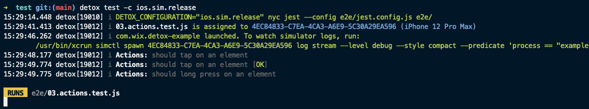

import Location from './partials/_location.mdx';

# Logger

The `logger` section controls how the printed logs are going to look like in your terminal window.



## Location

<Location sectionName="logger" />

## Properties

## `logger.level` \[enum\]

Default: `info`.

Possible values in the descending severity order: `fatal`, `error`, `warn`, `info`, `debug`, `trace`.

* Use `info` by default.
* Use `error` or `warn` when you want to make the output as silent as possible.
* Use `debug` to control what generally is happening under the hood.
* Use `trace` when troubleshooting specific issues.

    maxExceptionLines?: number | 'auto';
    stringifiers?: { [key: string]: Stringifier | null };
    prefixers?: { [key: string]: Stringifier | null };
    indent?: string;
    showLoggerName?: boolean;
    showPid?: boolean;
    showLevel?: boolean;
    showMetadata?: boolean;
}
```

There's one caveat inside `logger.options`, however – all the custom functions **must not** use closures! That's
because they get `eval()`-ed every time the test runner spawns a new child worker process. In other words:

```js
const dontDoThis = date => date.toISOString();

module.exports = {
  logger: {
    level: 'debug',
    options: {
      // showDate: (date) => dontDoThis(date),
// highlight-next-line
      showDate: (date) => date.toISOString(), /* do this instead */
    },
  },
  // ...
};
```
