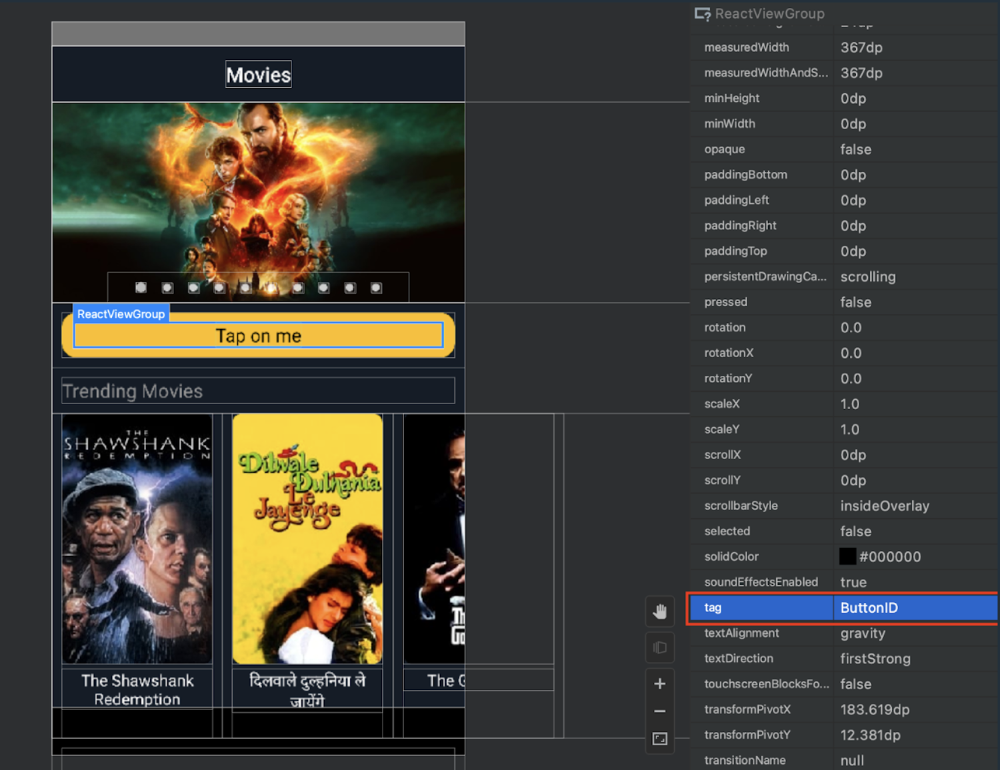

1. Make sure that React Native packager is already running. If not, you can start it with:
    ```bash
    npx react-native start
    ```
1. Launch Android Studio.
    :::
1. Select the component you need, and you will see your actual testID value under the `tag` attribute.
    
