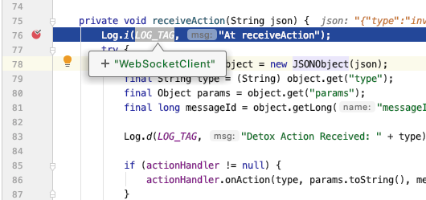

```plain text
18:26:07.024 detox[45214] i Waiting for you to manually launch your app in Android Studio.

Instrumentation class: com.wix.detox.test.test/com.example.DetoxTestAppJUnitRunner
Instrumentation arguments:
------------------------------------
Key            | Value
------------------------------------
detoxServer    | ws://localhost:8099
detoxSessionId | test
------------------------------------

Press any key to continue...
```




Happy debugging!
