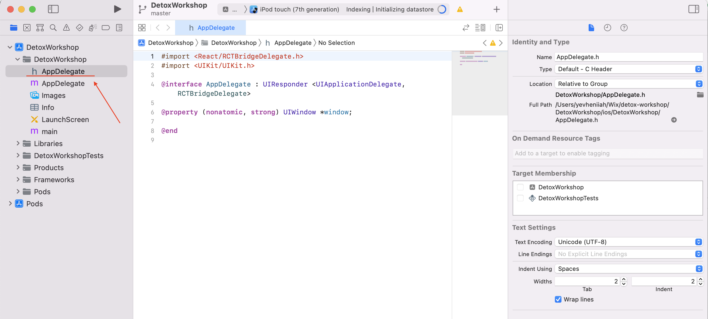
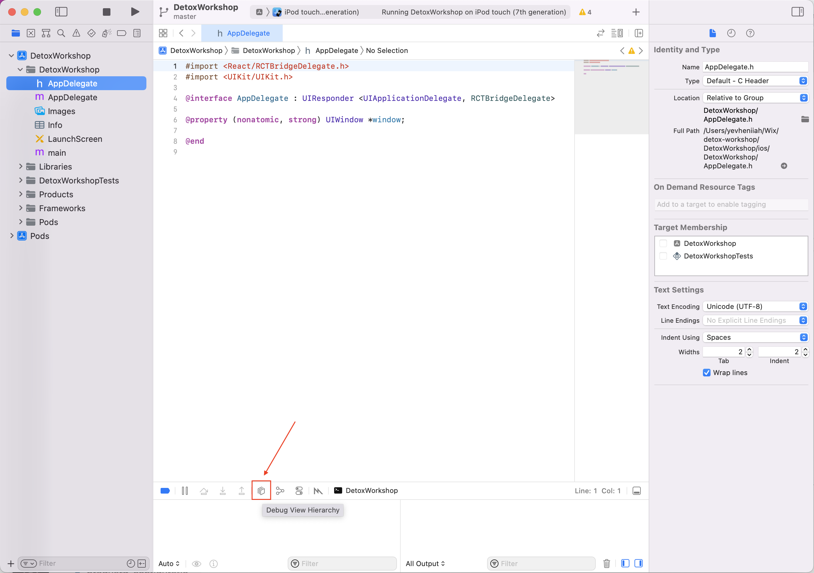
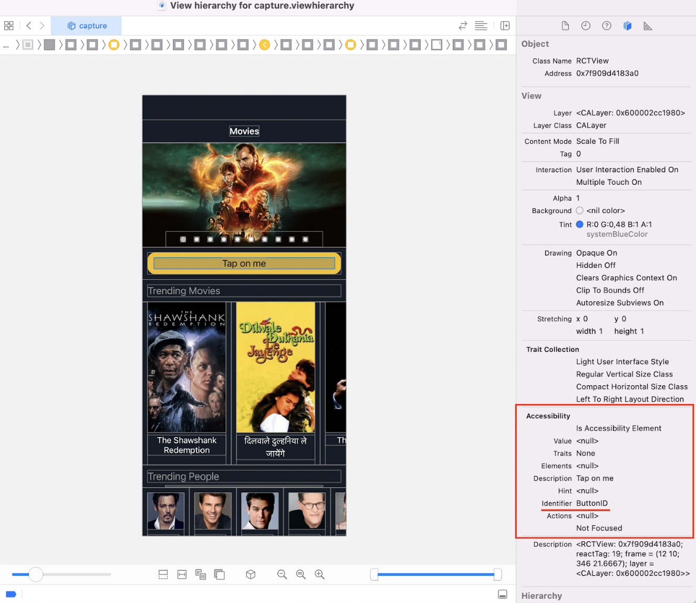

1. Build and start your app in _debug_ mode as you usually do, e.g.:
    ```sh
    detox build -c ios.sim.debug
    npx react-native start
    npx react-native run-ios
    
1. Click `Debug View Hierarchy` button on the bottom panel:
    
1. Select the component you need, and you will see your actual `testID` value under the `Accessibility > Identifier` attribute.
    
