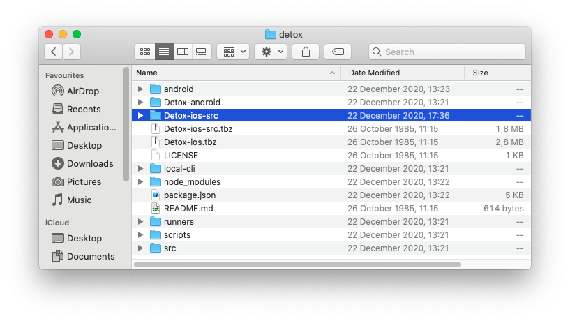

1. Go to `node_modules/detox` and extract `Detox-ios-src.tbz`

    

1. Drag `Detox-ios-src/Detox.xcodeproj` into your Xcode project

:::caution

Apps should not be submitted to the App Store with the Detox framework linked. Follow this guide only to debug Detox issues in your project. Once finished, make sure to remove **Detox.framework** from your project.

:::

