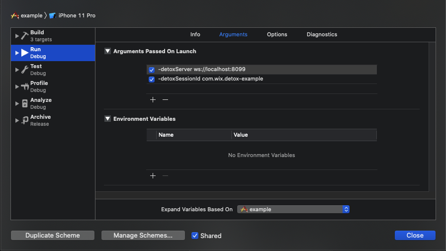

```plain text
18:26:07.024 detox[45214] i Waiting for you to manually launch your app in Xcode.
Make sure to pass the launch arguments listed below:
  -detoxServer ws://localhost:8099
  -detoxSessionId com.wix.detox-example

Press any key to continue...
```

You’ll need to run your app with the said arguments from Xcode:



Before you launch the app, make sure to [put breakpoints](https://developer.apple.com/documentation/xcode/setting-breakpoints-to-pause-your-running-app) at the points of interest, e.g.:


Happy debugging!

