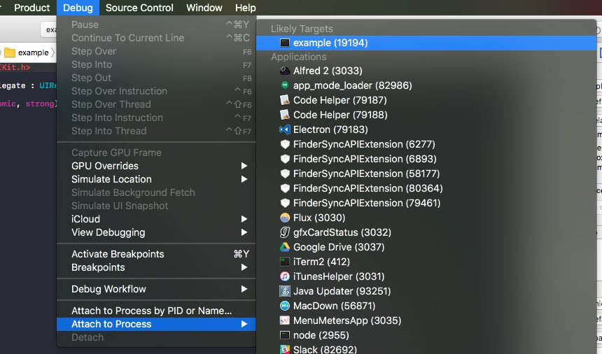
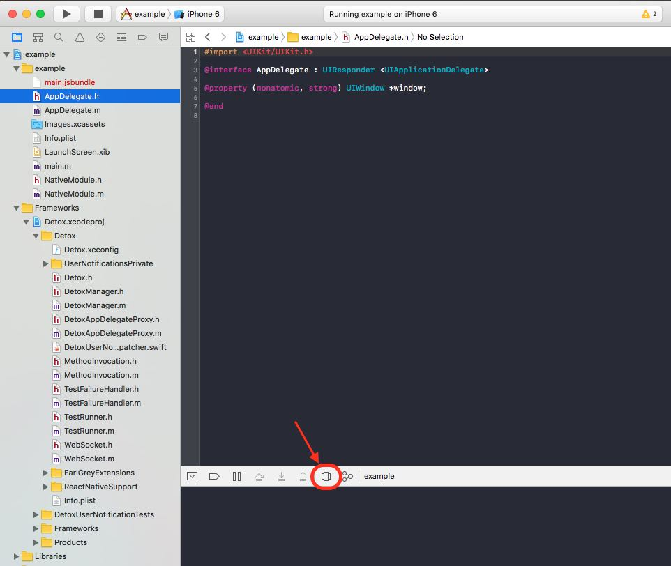
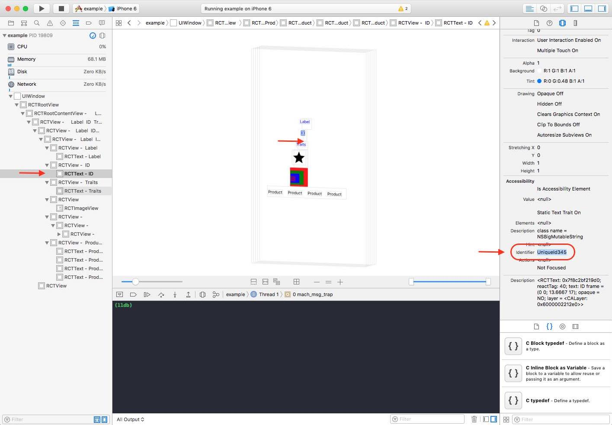

This page is about issues related to executing your Detox tests, typically triggered when running `detox test` (and not `detox build`, for example).

## Trace Mode

It’s a good idea to get as much information as possible about what’s going on. We can enable trace mode during tests by running our tests with:

```bash
detox test --loglevel trace
```

## No simulators found (iOS)

In order to run tests on a simulator, you need to have simulator images installed on your machine. This process is performed by Xcode itself. You can list all available simulators using `simctl` by typing `xcrun simctl list` in terminal.

If you’re missing a simulator, make sure Xcode is installed and use it to download the simulator. Take a look at the Preferences screen, some screenshots can be seen [here](http://stackoverflow.com/questions/33738113/how-to-install-ios-9-1-simulator-in-xcode-version-7-1-1-7b1005).

Once the desired simulator is installed and returned by `xcrun simctl list`, double check its name in the list and make sure this name is found in the `detox` configuration entry in `package.json`. The reference for the configuration options is available [here](../config/devices.mdx).

## Tests execution hangs

**Issue:** A while after running Detox, you get a message about failure to connect to the running app, in the logs:

```plain text
Detox can’t seem to connect to the test app(s)!
```

This can be a result of various reasons. It is generally up to you to debug and find the root cause. In any case, below are the common ones.

### If you do not see your app running on the device

- You might have forgotten to run `device.launchApp()` in the beginning of your test.
- The app might have crashed before Detox has had a chance to connect to it. To get the crash details, you can run Detox tests with `--record-logs all` CLI option and then inspect the device logs in the artifacts' folder.
- **On Android**, there might be a problem with the native test code in the `DetoxTest.java` file. Revisit the [associated section](../introduction/project-setup.mdx#step-4-additional-android-configuration) in the setup guide.

### If you _do_ see your app running on the device

- **On Android with SDK≥28**, the app’s connection to the Detox test server is blocked due to clear-traffic blockage (as reported in issue [#1450](https://github.com/wix/Detox/issues/1450)).
  The main step for getting this fixed is to revisit the [associated section](../introduction/project-setup.mdx#step-4-additional-android-configuration) in the setup guide, which discusses network-security. Alternatively, the `android:usesCleartextTraffic="true"` attribute can be configured in the `<application>` tag of the app’s `AndroidManifest.xml`, but **that is highly discouraged**.
- If you’ve applied the above suggestion but the app fails to connect to the Detox test server, nonetheless: Refer to the device’s logs, which should contain messages about failed connection attempts (get them using the `--record-logs all` argument)
- The app could be running without Detox native code injected. In this case, first, make sure you’re not trying to run in manual launch mode (where this behavior is valid). If so, examine the logs from the device (get them using the `--record-logs all` argument). If you see a crash related to Detox’s native code, you are welcome to report it on our GitHub tracker.
- If you are in fact debugging your native code integration with Detox, our [Debugging tutorial](../introduction/debugging.mdx) may prove helpful.

## Syntax Error: Unexpected Token

**Issue:** Running tests immediately throws the following error:

```js
beforeEach(async () => {
                   ^
SyntaxError: Unexpected token (
    at Object.exports.runInThisContext (vm.js:76:16)
    at Module._compile (module.js:545:28)
    at loader (/Users/builduser/buildAgent/work/34eee2d16ef6c34b/node_modules/babel-register/lib/node.js:144:5)
    at Object.require.extensions.(anonymous function) [as .js] (/Users/builduser/buildAgent/work/34eee2d16ef6c34b/node_modules/babel-register/lib/node.js:154:7)
...
child_process.js:531
    throw err;
```

**Solution:** This error means that your version of Node does not support `async-await` syntax. You should do the following:

1. Update Node to a version **8.3.0 or higher**.

## Can’t Find My Component Even Though I Added a `testID` to Its Props

**Issue:** Detox fails to match a component even though it has a `testID`. Detox will throw the following error:

```plain text
Error: Cannot find UI Element.
Exception with Assertion: {
  "Assertion Criteria" : "assertWithMatcher: matcherForSufficientlyVisible(>=0.750000)",
  "Element Matcher" : "(((respondsToSelector(accessibilityIdentifier) && accessibilityID('Welcome')) && !kindOfClass('RCTScrollView')) || (kindOfClass('UIScrollView') && ((kindOfClass('UIView') || respondsToSelector(accessibilityContainer)) && ancestorThatMatches(((respondsToSelector(accessibilityIdentifier) && accessibilityID('Welcome')) && kindOfClass('RCTScrollView'))))))",
  "Recovery Suggestion" : "Check if element exists in the UI, modify assert criteria, or adjust the matcher"
}

Error Trace: [
  {
    "Description" : "Interaction cannot continue because the desired element was not found.",
    "Domain" : "com.google.earlgrey.ElementInteractionErrorDomain",
    "Code" : "0",
    "File Name" : "GREYElementInteraction.m",
    "Function Name" : "-[GREYElementInteraction matchedElementsWithTimeout:error:]",
    "Line" : "119"
  }
]
```

**Solution:** React Native only supports the `testID` prop on the native built-in components. If you’ve created a custom composite component, you will have to support this prop yourself. You should probably propagate the `testID` prop to one of your rendered children (a built-in component):

```jsx
export class MyCompositeComponent extends Component {
  render() {
    return (
      <TouchableOpacity testID={this.props.testID}>
        <View>
          <Text>Something something</Text>
        </View>
      </TouchableOpacity>
    );
  }
}
```

Now, adding `testID` to your composite component should work:

```jsx
render() {
  return <MyCompositeComponent testID='MyUniqueId123' />;
}
```

## Test Tries to Find My Component Before It’s Created

**Issue:** Due to a synchronization issue, the test tries to perform an expectation and fails because it runs the expectation too soon. Consider this example:

```js
await element(by.text('Login')).tap();
await expect(element(by.text('Welcome'))).toBeVisible();
```

In the test above, after tapping the Login button, the app performs several complex asynchronous operations until the Welcome message is displayed post-login. These can include querying a server, waiting for a response and then running an animated transition to the Welcome screen. Detox attempts to simplify your test code by synchronizing _automatically_ with these asynchronous operations. What happens if for some reason the automatic synchronization doesn’t work? As a result, Detox will not wait correctly until the Welcome screen appears and instead will continue immediately to the next line and try to run the expectation. Since the screen is not there yet, the test will fail.

**Solution:** When you suspect that automatic synchronization didn’t work, you have a fail-safe by synchronizing manually with `waitFor`. Using `waitFor` will poll until the expectation is met. This isn’t a recommended approach so please use it as a workaround and open and issue to resolve the synchronization issue.

This is what the fixed test would look like:

```js
await element(by.text('Login')).tap();
await waitFor(element(by.text('Welcome'))).toBeVisible().withTimeout(2000);
```

## Can’t synchronize the test with my app

If you suspect that the test is failing because Detox fails to synchronize the test steps with your app, take a look at this in-depth [synchronization troubleshooting tutorial](synchronization.md).

## An Element is Not Visible

**On iOS**, you may run in a situation, when one of the interactions (tap, scroll, etc.) on an element fails with an error like:

```plain text
Test Failed: View "<RCTScrollView: 0x7f8d32296d70>" is not visible: view does not pass visibility threshold (0% visible of 75% required)
```

1. Try retrieving `ui.viewhierarchy` artifact — sometimes examining the hierarchy visually can give you insights.
   Add a line `"uiHierarchy": "enabled"` to your artifacts' configuration in `.detoxrc.js`, like in an example here: [Artifacts Configuration](../config/artifacts.mdx). After a rerun, you should find
   a `ui.viewhierarchy` in a folder of your failing test. Please mind that you need Xcode 12 at least to open `*.viewhierarchy` files.

1. Besides, you can rerun your iOS app tests with `--take-screenshots failing`. What will happen is, for each view that fails visibility, two images will be saved at `artifacts/<configuration-timestamp-dir>/<test name>/DETOX_VISIBILITY_<viewType>__<viewID>__SCREEN.png` (and `.../DETOX_VISIBILITY_<viewType>__<viewID>__TEST.png` folder aside) with autogenerated names, e.g. `DETOX_VISIBILITY_RCTTextView__0x7fab7660f3e0__TEST.png`:

|                                                            in `DETOX_*_SCREEN.png`                                                           |                                                              in `DETOX_*_TEST.png`                                                             |
| :------------------------------------------------------------------------------------------------------------------------------------------: | :--------------------------------------------------------------------------------------------------------------------------------------------: |
|  |  |

The first is supposed to show what is seen on screen. The second shows the internal buffer that Detox tests for visibility; if the pixels aren’t transparent enough and less than 75% of tested region is not transparent, the view is not considered visible.

If you are developing a React Native app, then the following applies. If, for instance, you see that tapping fails due to a view with `pointerEvents="none"` obscuring your target — well, the only solutions are: either to make the obscurer a descendant of your target (instead of being a sibling), or to tap on the parent container.

If you see that your issue cannot be solved via testID replacement or a simple hierarchy rearrangement, then there’s a chance this is a bug in Detox. Make sure to provide your `ui.viewhierarchy` artifact, the generated `DETOX_VISIBILITY_*` pictures and a comprehensive description of the issue backed up with sound arguments.

## Debug View Hierarchy

**Issue:** I added the `testID` prop, but I still can’t find the view by id in my tests.

**Solution:** You can investigate the app’s native view hierarchy, this might shed some light on how the app’s view hierarchy is laid out.

Do the following:

1. Start a debuggable app (not a release build) in your simulator
1. Open Xcode
1. Attach Xcode to your app’s process
   
1. Press the `Debug View Hierarchy` button
   
1. This will open the hierarchy viewer, and will show a breakdown of your app’s native view hierarchy. Here you can browse through the views
1. React Native testIDs are manifested as _accessibility identifiers_ in the native view hierarchy

Let’s see an example. We will find the following view in the native hierarchy:

```jsx
<TouchableOpacity onPress={this.onButtonPress.bind(this, 'ID Working')}>
  <Text testID='UniqueId345' style={{color: 'blue', marginBottom: 20}}>ID</Text>
</TouchableOpacity>
```

This is the hierarchy viewer, pointing to the native view just mentioned:



## Compare to a Working Setup

If you feel lost, try starting from a working example for sanity.

There are multiple working examples included in this repo, such as [demo-react-native](https://github.com/wix/Detox/tree/master/examples/demo-react-native).

First, install, build and make sure the tests are indeed passing. If they are, try comparing this setup with what you have.

## Take a Look at Past Issues

Before opening a new issue, search the [list of issues](https://github.com/wix/detox/issues?utf8=%E2%9C%93\&q=is%3Aissue) on GitHub. There’s a good chance somebody faced the same problem you are having.

## How to Open a New Issue

Before opening a new issue, please follow the entire troubleshooting guide and go over past issues.

General usage questions should be opened on Stack Overflow, where the core Detox team is active and responds to questions:
<https://stackoverflow.com/questions/tagged/detox>

If you believe you are seeing a Detox issue, select the correct template from the options, and make sure to fill all requested information in the template. Omitting important information will likely result in a closed issue.
